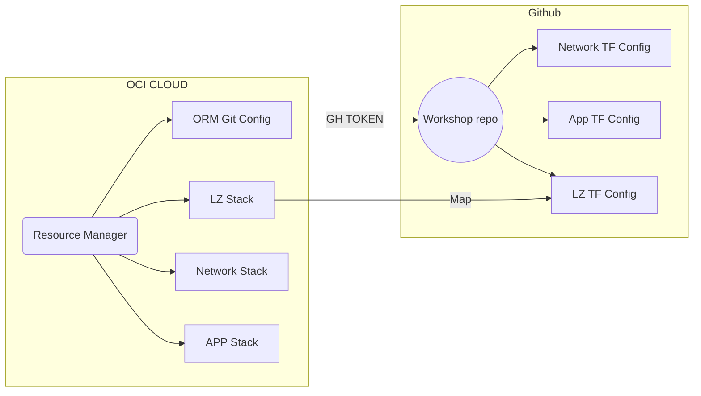

# Lab 01 - Deploy a Landing Zone

## Goals
In this lab we are going to deploy a Landing Zone that a platform engineering team would deploy for other teams to use

### Intro
Besides our documentation, a good resource to get _hands-on_ started in OCI is the :octocat: Github repo [`oracle-devrel/technology-engineering`](https://github.com/oracle-devrel/technology-engineering). In this repo you can find a technical introduction to the different [Landing Zones developed by Oracle](https://github.com/oracle-devrel/technology-engineering/tree/main/landing-zones) and an explanation on when to use each one of them.

# Task 1 Prepare your DevOps tools.
```sh
# Connect your Github account with OCI using a ORM VCS Provider
OCI_GIT_CONFIG_OCID=$(oci resource-manager configuration-source-provider create-github-access-token-provider --compartment-id "$OCI_TENANCY" --access-token "$(gh auth token)" --api-endpoint "https://github.com"  --display-name "gh-config-01" --query data.id --raw-output)
echo "export OCI_GIT_CONFIG_OCID=\"${OCI_GIT_CONFIG_OCID}\"" >> ~/.bashrc

# Create a Stack that points to where the Landing Zone is declared as IaC
OCI_LZ_STACK_OCID=$(oci resource-manager stack create-from-git-provider --compartment-id "$OCI_TENANCY" --config-source-configuration-source-provider-id "$OCI_GIT_CONFIG_OCID" --config-source-branch-name main --config-source-repository-url "$(gh repo view --json url -q .url)" --config-source-working-directory 'core-team/infra/lz' --display-name "stack-gh-oci-lz-01" --terraform-version "1.2.x" --variables "{\"tenancy_ocid\":\"$OCI_TENANCY\" , \"region\":\"$OCI_REGION\"}" --query data.id --raw-output)
echo "export OCI_LZ_STACK_OCID=\"${OCI_LZ_STACK_OCID}\"" >> ~/.bashrc
```

