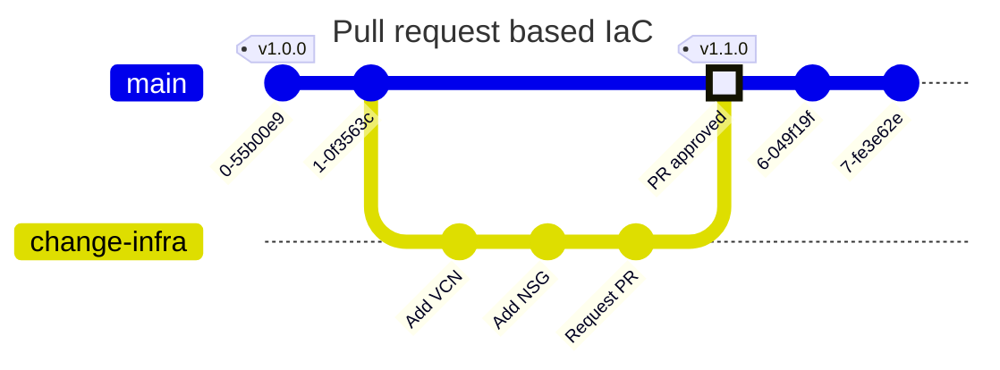

# Lab 02 - Platform Engineering

## Goals
In this lab we are going to create a simple workflow based on DevSecOps principles to operate the aldnig zone and get ready to deploy a workload

### Intro
Our landing zone is deployed, but is important to understand besides to help to deploy a compliant foundation; it does enable practices meant to deliver infrastructure in a better manner.
Let's watch an opinionated view of what a Platform Engineering team should do according to Hashicorp :tv: [What Is a Platform Team and What Problems Do They Solve?](https://youtu.be/j5M16qooAvo).

In this lab we are going to make a simple technical implementation of a workflow based in DevOps practices that a platform Engineering team would use.

## Task 1 - Configure your repo to allow collaboration
We are going to use the feature `Branch protection rules` in GitHub, with the prupose of enable some of the practices in the DevOps principles
- Early Feedback
    - Peer review
    - Especulative Plan
- Experimentation
    - Use branches to test new features

Navigate to your repository in GitHub and go to `Code and automation > Branches` and create new branch protection rule.

When the rule is in place, the following workflow would be followed

## Task 2 - Implement a flow using Github Actions
We are going to use GitHub actions to implement the technical practice of flow in DevOps practices.We are going to use automation in order to
- Ensure quality
- Get feedback
- Allow for visbility of work

Let's inspect the file [`lz.yml`](../../.github/workflows/lz.yml). This action is meant to run everytime a psuh request to main and do
- Linting of terraform Code
- Run a speculative plan
- Post the plan so the reviewers can understand the impact of the changes.

Let's try to run it. IF you see a fail don't worry