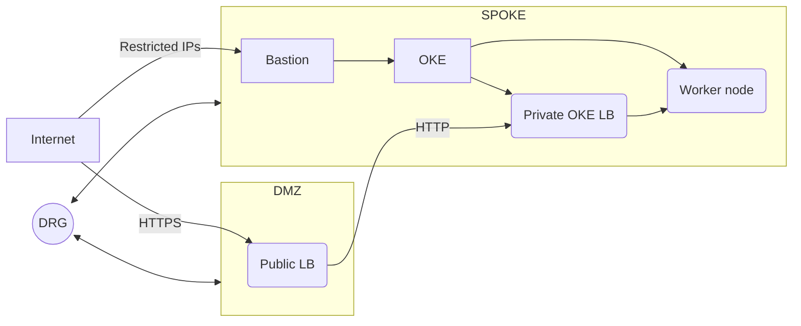

# Lab 03 - Deploying a Workload infrastructure

## Goals
In this lab we are going to deploy a OKE cluster and using the additional components required to run a workload

### Intro
The CIS Landing zone defines roles for diferent functions. We are going to simulate that we are part of the `Appdev` group and we are going to deploy the infrastrtucture required to run a dummy workload in Kubernetes.

## Task 1 - Deploy network functions
Before deploying we are going deploy a OCI bastion service. This bastion will be used to operate the OKE cluster while minimizing the attack surface. In this task we are going to simulate to be part of the networking team (which could be the same core-platform team).

> For the simplicity of deploying infrastructure in a short time, we are going to deploy the network compoenents using our local isntallation of terraform

In your terminal, navigate to the folder [`core`](../../core-team/infra/network/), and execute the command `cp example.tfvars local.auto.tfvars`. In this simulation, we assume that the network team is given the parameter values from the platform team.
```hcl
tenancy_ocid                         = "ocid1.tenancy.oc1..xyz"
region                               = "eu-frankfurt-1"
compartment_id                       = "ocid1.compartment.oc1..xyz"
prefix_service_label                 = "my-prefix"
app_k8s_subnet_id                    = "ocid1.subnet.oc1.eu-frankfurt-1.xyz"
bastion_client_cidr_block_allow_list = ["A.B.C.D/24"]
spoke_app_cidr                       = "A.B.C.D/24"
lz_spoke_vcn_ocid                    = "ocid1.vcn.oc1.eu-frankfurt-1.xyz"
dmz_services_nsg_ocid                = "ocid1.networksecuritygroup.oc1.eu-frankfurt-1.xyz"
outdoor_subnet_id                    = "ocid1.subnet.oc1.eu-frankfurt-1.xyz"
```
After modifying the variables file, deploy the network functions
```sh
terraform init
terraform validate
terraform plan
terrafom apply
```
Our goal is to have the following conceptual networking architecture

## Task 2 - Deploy OKE infrastructure
In this task we are going to simale being part of an application team, that is going to deploy the basic OKE configuration. The terraform code is based in our curated Terraform Module [`OKE Module Installer`](https://registry.terraform.io/modules/oracle-terraform-modules/oke/oci/latest). This module is a ready-to-deploy configuration for OKE and supporting functions in many architectures. At the moment the module does not allow to reuse subnets and network components created in other modules, for this reason, the `App` terraform configuration is a stripped down version of the module.

Our target architecture will try to accomodate to the modules topology:


In your terminal, navigate to the folder [`app-team/infra/app1`](../../app-team/infra/app1), and execute the command `cp example.tfvars local.auto.tfvars`. In this simulation, we assume that the network team is given the parameter values from the platform team.
```hcl
tenancy_ocid                         = "ocid1.tenancy.oc1..xyz"
region                               = "eu-frankfurt-1"
compartment_id                       = "ocid1.compartment.oc1..xyz"
prefix_service_label                 = "my-prefix"
app_k8s_subnet_id                    = "ocid1.subnet.oc1.eu-frankfurt-1.xyz"
bastion_client_cidr_block_allow_list = ["A.B.C.D/24"]
spoke_app_cidr                       = "A.B.C.D/24"
lz_spoke_vcn_ocid                    = "ocid1.vcn.oc1.eu-frankfurt-1.xyz"
dmz_services_nsg_ocid                = "ocid1.networksecuritygroup.oc1.eu-frankfurt-1.xyz"
outdoor_subnet_id                    = "ocid1.subnet.oc1.eu-frankfurt-1.xyz"
```
After modifying the variables file, deploy the OKE functions
```sh
terraform init
terraform validate
terraform plan
terrafom apply
```
