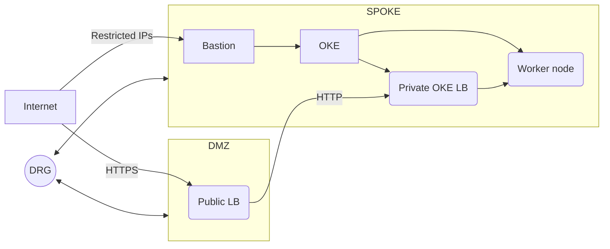

# Lab 04 - Deploying a workload inside OKE

## Goals
In this lab we are going to use the Bastion service to operate the OKE cluster using `kubectl`

### Intro
Having a recap of the network setup

The bastion service is the only resource to have Just-in-time access to the cluster. We are going to use the feature [SSH port forwarding session](https://docs.public.oneportal.content.oci.oraclecloud.com/en-us/iaas/Content/Bastion/Concepts/bastionoverview.htm#ariaid-title3) to connect our work station to the OKE cluster API endpoint.

## Task 1 - Create a port-forwarding session
```sh
export bastion_ocid="<bastion>"
export oke_api_address="<oke_ip>"
# Create a keypair in Openssl
ssh-keygen -t ssh-ed25519 -N "" -b 2048 -f ~/.ssh/k8s_bastion
# ssh-keygen -t rsa -N "" -b 2048 -f ~/.ssh/k8s_bastions

# Create a port-forwarding session
oci bastion session create-port-forwarding --bastion-id $bastion_ocid --ssh-public-key-file ~/.ssh/k8s_bastion.pub --key-type PUB --target-private-ip $oke_api_address --target-port 6443
# Create the local poprt forwarding
ssh -i ~/.ssh/k8s_bastio -N -L "6443:${oke_api_address}:6443" -p 22 "${bastion_session_ocid}@host.bastion.eu-frankfurt-1.oci.oraclecloud.com" #-o "ProxyCommand=nc -X connect -x www.proxy.com:80 %h %p"
```
## Task 2 - Configure and check the kubectl context
Now that the tunnel is created, ourt work station can sedn HTTP requests to the cluster API endpoint. The next step is to configure our workstation `kubectl` context to 
``` sh
export oke_ocid="<oke>"
oci ce cluster create-kubeconfig --cluster-id $oke_ocid --file $HOME/.kube/config --token-version "2.0.0" --kube-endpoint PRIVATE_ENDPOINT
```
Now we can explore the file `~/.kube/config` to check how the API endpoint is configured in our work station. Due to we are doing port forwarding, we have to change the cluster address to `127.0.0.1`.
```sh
#change kubectl server endpoint
vim ~/.kube/config
kubectl cluster-info
```
## Task 3 - Create an empty namespace
Now that our work station is configured, we can create a simple kubernetes namespace
```sh
kubectl create namespace gb
# Deploy a sample workload
kubectl apply -f "https://raw.githubusercontent.com/kubernetes/examples/master/guestbook/all-in-one/guestbook-all-in-one.yaml" -n gb
kubectl get pods -n gb
```
Why is it failing?
Deploy images to ocir
``` sh

kubectl create secret docker-registry <secret-name> --docker-server=<region-key>.ocir.io --docker-username=<tenancy-namespace>/<oci-username> --docker-password='<oci-auth-token>' --docker-email=<email-address>

docker login fra.ocir.io
# use <tenancy-namespace>/<username
export compartment_id="<substitute-value-of-compartment_id>"

oci artifacts container repository create --compartment-id $compartment_id --display-name sebcegal-cir-app1/redis
docker pull arm64v8/redis:6.0
docker tag arm64v8/redis:6.0 fra.ocir.io/nose/sebcegal-cir-app1/redis:v6 
docker push fra.ocir.io/nose/sebcegal-cir-app1/redis:v6

oci artifacts container repository create --compartment-id $compartment_id --display-name sebcegal-cir-app1/gb-redisslave
docker pull gcr.io/google-samples/gb-redisslave-arm64:v3
docker tag gcr.io/google-samples/gb-redisslave-arm64:v3 fra.ocir.io/nose/sebcegal-cir-app1/gb-redisslave:v3 
docker push fra.ocir.io/nose/sebcegal-cir-app1/gb-redisslave:v3

oci artifacts container repository create --compartment-id $compartment_id --display-name sebcegal-cir-app1/gb-frontend
docker pull gcr.io/google-samples/gb-frontend-arm64:v6
docker tag gcr.io/google-samples/gb-frontend-arm64:v6 fra.ocir.io/nose/sebcegal-cir-app1/gb-frontend:v6
docker push fra.ocir.io/nose/sebcegal-cir-app1/gb-frontend:v6
```


